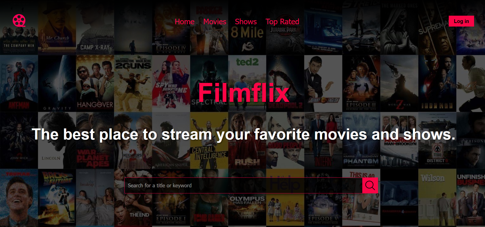

# Filmflix-streaming
### A simple website to watch movies and shows using the TMDB and Vidstreaming APIs.

> [!WARNING]
> This website is neither responsive nor mobile-friendly, It is recommended to view it on a desktop or laptop, this is just a front-end project, so the login and signup pages are not functional, the search bar is functional and will display the results of the search query.

> [!NOTE]
> This is just a school project, and is not intended for commercial use, it is also my first project using HTML, CSS, and JavaScript, I hope you find it interesting.

Don't forget to put in the api in order to fetch the data from the moviedb api, You can get the api key by signing up on the [TMDB](https://www.themoviedb.org/) website.
That's pretty much it, you are free to use the code and modify it as you like. 
